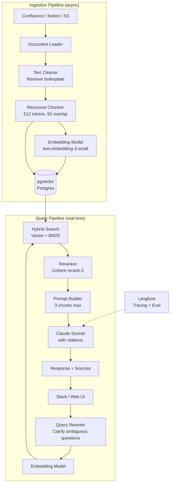
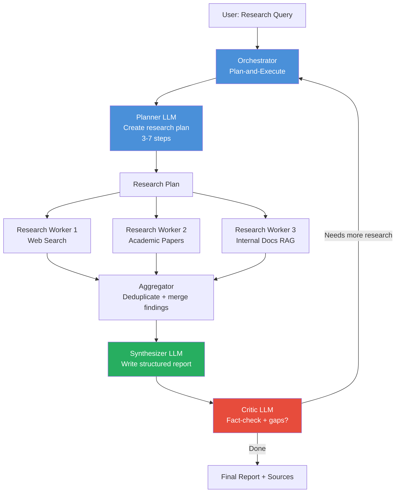
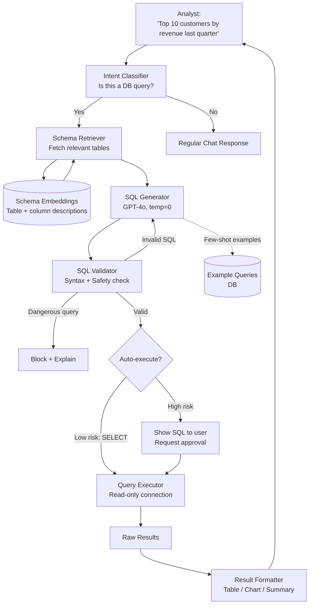

# Capstone — System Design Examples

> Three complete GenAI system designs. For each: architecture, components, and the reasoning behind every decision.

---

## Design 1 — AI Knowledge Assistant (Internal Documentation RAG)

**The problem:** A company has thousands of pages of internal docs, runbooks, and wikis. Employees waste hours searching. You want a natural-language interface that answers questions accurately, with citations.

---

### Architecture



---

### Component Decisions

| Component | Choice | Why |
|-----------|--------|-----|
| Vector DB | pgvector | Already have Postgres; < 500K chunks |
| Embedding | text-embedding-3-small | Cost-effective, good quality |
| Reranker | Cohere rerank-3 | Significantly improves relevance |
| LLM | Claude Sonnet | 200K context, excellent instruction-following |
| Chunk size | 512 tokens | Precise retrieval for technical docs |
| Max chunks in prompt | 3 | Balance between context and cost |

---

### Key Design Decisions Explained

**1. Query Rewriting**
```
Problem:  Users write vague queries like "it's broken" or "the thing we talked about"
Solution: LLM rewrites query before retrieval

"it's broken" → "deployment pipeline error troubleshooting steps"
"the thing we talked about" → [needs clarification from user]

Why: Retrieval is only as good as the query. Garbage in = garbage out.
```

**2. Hybrid Search**
```
Vector search alone misses:
  - Exact error codes ("ERR_SSL_PROTOCOL_ERROR")
  - Specific API endpoint names ("/api/v2/users")
  - Product version numbers ("v3.4.1")

BM25 keyword search catches exact matches.
Combined = best precision for technical documentation.
```

**3. Mandatory Citations**
```
System prompt includes:
"Every factual claim must reference a source document in the format [Source: filename, section]."

Result: "The rate limit is 1000 req/min [Source: api-docs.md, Rate Limiting]"

Why: Users can verify. Hallucinations become auditable. Trust increases.
```

**4. Incremental Ingestion**
```
Don't re-index entire corpus on every update.

Approach:
  - Webhook on doc changes → queue updated docs
  - Re-process only changed pages
  - Track last_indexed timestamp per document
  - Delete + re-insert changed chunks (by source metadata)

Why: Re-indexing 100K pages takes hours. Incremental takes seconds.
```

---

### System Prompt

```
You are a helpful internal knowledge assistant for [Company].

RULES:
1. Answer ONLY based on the provided context documents.
2. If the answer is not in the context, say: "I don't have that information
   in our docs. You may want to ask in #engineering-help."
3. Every factual claim must cite its source: [Source: filename, section]
4. Be concise. No filler text.
5. If the question is ambiguous, ask for clarification before answering.

FORMAT:
- Use bullet points for lists
- Use code blocks for code, commands, and config
- Include source citations inline
```

---

## Design 2 — AI Research Agent

**The problem:** Analysts spend days researching topics, reading papers, and synthesizing information. You want an agent that can be given a research question, autonomously gather information from multiple sources, and produce a structured report.

---

### Architecture



---

### Tools Available to Workers

```python
RESEARCH_TOOLS = [
    {
        "name": "web_search",
        "description": "Search the web for current information on a topic",
        "parameters": {
            "query": "string — specific search query",
            "num_results": "int — number of results (max 10)"
        }
    },
    {
        "name": "fetch_url",
        "description": "Fetch and extract clean text from a URL",
        "parameters": {
            "url": "string — the URL to fetch"
        }
    },
    {
        "name": "search_papers",
        "description": "Search academic papers via Semantic Scholar API",
        "parameters": {
            "query": "string",
            "year_from": "int — filter papers from this year onwards"
        }
    },
    {
        "name": "search_internal_docs",
        "description": "Search company knowledge base using semantic search",
        "parameters": {
            "query": "string",
            "doc_type": "string — optional: 'technical', 'business', 'legal'"
        }
    }
]
```

---

### Key Design Decisions Explained

**1. Parallel Worker Execution**
```
Sequential (bad):                  Parallel (good):
  Web search:   15s                 All three workers: 15s (slowest)
  Papers:       20s                 Not: 15 + 20 + 10 = 45s
  Internal:     10s
  Total:        45s

Workers are independent — run them concurrently.
Use asyncio or a thread pool. Return results when all complete.
```

**2. Plan-and-Execute**
```
Why not just ReAct?

ReAct is exploratory — each step depends on the previous observation.
Good for: "Is this vulnerability exploitable?" (dynamic)

Plan-and-Execute works better when:
  - Task has predictable sub-questions
  - Sub-questions can be parallelized
  - You want user to review/approve the plan first

Research tasks → Plan-and-Execute wins.
```

**3. Generator + Critic Loop**
```
Max 2 iterations to prevent loops.

Critic checklist:
  □ Are all sub-questions from the plan answered?
  □ Are there contradictions between sources?
  □ Are there obvious gaps in coverage?
  □ Are all claims backed by a source?

If any fail → orchestrator dispatches targeted follow-up searches.
```

**4. Human Checkpoint (Optional)**
```
After plan generation, optionally pause:

"Here's my research plan:
 1. Search for recent market data on X
 2. Find competitor pricing for Y
 3. Look for analyst reports on Z

Proceed? [Yes / Modify / Cancel]"

Why: Research can be expensive (many LLM calls). Align before spending.
```

---

### Output Schema

```python
class ResearchReport(BaseModel):
    title: str
    executive_summary: str          # 3-5 sentences
    key_findings: list[str]         # bullet points
    sections: list[ReportSection]   # detailed sections
    sources: list[Source]           # all citations
    confidence: Literal["high", "medium", "low"]
    gaps: list[str]                 # what couldn't be found

class Source(BaseModel):
    title: str
    url: str
    relevance: str                  # one sentence why this was used
    accessed_at: datetime
```

---

## Design 3 — AI Database Query Assistant (Natural Language to SQL)

**The problem:** Business analysts without SQL skills need to query the data warehouse. They currently wait for data engineers to write queries. You want a natural language interface that generates and executes SQL safely.

---

### Architecture



---

### Component Decisions

| Component | Choice | Why |
|-----------|--------|-----|
| SQL Generator | GPT-4o, temperature=0 | Deterministic output required for code |
| Schema retrieval | Semantic search on descriptions | Full schema too large for context |
| Database connection | Read-only service account | Cannot modify data regardless of what SQL is generated |
| Few-shot examples | Retrieved based on query similarity | Domain-specific patterns improve accuracy |
| Validator | sqlparse + custom safety rules | Catch issues before execution |

---

### The Schema Embedding Trick

```
PROBLEM: Large data warehouse has 300+ tables, 3000+ columns.
         Full schema = 80,000+ tokens. Too expensive and noisy.

SOLUTION: Embed table descriptions, retrieve only relevant ones.

For each table, create a natural language description:
────────────────────────────────────────────────────────────────
"orders table: contains customer purchase records.
 Columns: order_id (PK, bigint), customer_id (FK→users.id),
 total_amount (decimal, in USD), created_at (timestamp, UTC),
 status (enum: pending/processing/shipped/delivered/cancelled),
 shipping_address_id (FK→addresses.id)"
────────────────────────────────────────────────────────────────

Embed each description → store in vector DB with table name.

At query time:
  1. "Top 10 customers by revenue last quarter"
  2. Embed query
  3. Retrieve top 5 most relevant table descriptions
  4. Only inject those 5 into the SQL generation prompt

Result: Context stays < 3,000 tokens, highly focused.
```

---

### Safety Layers

```
SQL SAFETY — DEFENSE IN DEPTH
─────────────────────────────────────────────────────────────────
Layer 1: System prompt
  "Generate SELECT queries ONLY.
   NEVER write INSERT, UPDATE, DELETE, DROP, ALTER, TRUNCATE,
   CREATE, GRANT, REVOKE, or any DDL/DML statements."

Layer 2: Static SQL analysis (sqlparse)
  Parse AST of generated SQL
  Reject programmatically if:
    - Any non-SELECT statement found
    - Accesses restricted tables (salary, pii_*, audit_log)
    - No LIMIT clause (add one automatically)
    - Query references > 10 tables (complexity limit)

Layer 3: Database permissions
  Connect with: CREATE ROLE analyst_readonly;
                GRANT SELECT ON SCHEMA public TO analyst_readonly;
  Even if layers 1+2 fail: DB rejects writes by design.

Layer 4: Resource limits (set in Postgres)
  statement_timeout = '30s'
  work_mem = '256MB'
  Prevents runaway queries from affecting production.

Layer 5: Audit logging
  Every query: user_id, generated_sql, rows_returned, cost_ms
  Enables review, compliance, and abuse detection.
─────────────────────────────────────────────────────────────────
```

---

### Few-Shot Example Retrieval

```python
# Store validated, domain-specific example query pairs
EXAMPLE_QUERIES = [
    {
        "question": "Top 10 customers by revenue last quarter",
        "sql": """
            SELECT
                u.name,
                u.email,
                SUM(o.total_amount) as total_revenue,
                COUNT(o.id) as order_count
            FROM orders o
            JOIN users u ON o.customer_id = u.id
            WHERE o.created_at >= date_trunc('quarter', NOW() - INTERVAL '3 months')
              AND o.created_at < date_trunc('quarter', NOW())
              AND o.status = 'delivered'
            GROUP BY u.id, u.name, u.email
            ORDER BY total_revenue DESC
            LIMIT 10
        """,
        "embedding": [...]  # pre-computed at ingestion time
    },
    {
        "question": "Monthly active users for the past 6 months",
        "sql": """
            SELECT
                date_trunc('month', last_login_at) as month,
                COUNT(DISTINCT id) as mau
            FROM users
            WHERE last_login_at >= NOW() - INTERVAL '6 months'
            GROUP BY 1
            ORDER BY 1
        """,
        "embedding": [...]
    }
    # ... hundreds more examples
]

def get_relevant_examples(user_query: str, k: int = 3) -> list[dict]:
    """Retrieve k most similar example queries."""
    query_embedding = embed(user_query)
    return vector_db.search(query_embedding, k=k, collection="sql_examples")
```

**Why few-shot retrieval beats static examples:**

```
Static examples (in system prompt):
  Always the same 5 examples
  May not match user's domain
  Wastes tokens on irrelevant patterns

Retrieved examples (semantic search):
  Query: "churn rate by cohort"
  Returns: cohort analysis examples specifically
  Query: "sales funnel conversion"
  Returns: funnel analysis examples specifically

Result: 20-40% improvement in SQL correctness for domain queries.
```

---

### Result Formatting

```python
def format_results(sql: str, results: list[dict], user_query: str) -> Response:
    row_count = len(results)

    # Small result: show as table
    if row_count <= 20:
        return TableResponse(headers=results[0].keys(), rows=results)

    # Numeric result: suggest chart
    if is_time_series(results):
        return ChartResponse(type="line", data=results)

    if is_categorical_comparison(results):
        return ChartResponse(type="bar", data=results)

    # Large result: summarize with LLM
    if row_count > 100:
        summary = llm.call(f"""
            The user asked: "{user_query}"
            The query returned {row_count} rows.
            Here are the first 20: {results[:20]}

            Provide a 2-3 sentence summary of what the data shows.
        """)
        return SummaryResponse(summary=summary, download_url=export_csv(results))
```

---

## Summary — Mental Model Map

```
GENERATIVE AI ECOSYSTEM
═══════════════════════════════════════════════════════════════════

FOUNDATION
├── LLMs = next-token predictors trained on massive text corpora
├── Tokens = atomic unit (cost, limits, speed)
├── Embeddings = semantic vectors (foundation of search)
└── Context window = working memory (manage it carefully)

BASIC APPLICATIONS
├── Prompt = system instructions + context + history + user query
├── Prompt templates = parameterized, versioned, testable
├── Structured output = reliable parsing via JSON schema
└── Conversation = explicit state management (LLMs are stateless)

RAG (RETRIEVAL AUGMENTED GENERATION)
├── Why: solves knowledge cutoff + hallucination on specific facts
├── Ingest: load → chunk → embed → store in vector DB
├── Query: embed → search → rerank → inject → generate
└── Key decision: chunk size, overlap, hybrid vs. pure vector search

AGENTS
├── Loop: Reason → Act (tool call) → Observe → Repeat
├── Tools: functions LLM can call (you execute them)
├── Patterns: ReAct (exploration), Plan-and-Execute (complex tasks)
└── Memory: in-context (short) | external DB (long) | vector (semantic)

MULTI-AGENT
├── Orchestrator + Workers: delegation pattern
├── Pipeline: sequential transformation
├── Generator + Critic: quality improvement loop
└── Always: human-in-the-loop for irreversible actions

PRODUCTION
├── Latency: stream, cache, right-size models
├── Cost: model routing, prompt compression, semantic caching
├── Safety: guardrails in + out, PII, injection, toxicity
└── Quality: evaluation datasets, LLM-as-judge, trace logging
```

---

## What to Learn Next

After this crash course, deepen in the direction your work demands:

| Track | Next Steps |
|-------|-----------|
| **RAG Engineer** | LlamaIndex advanced features, RAG evaluation (RAGAS), hybrid search tuning |
| **Agent Builder** | LangGraph deep dive, OpenAI Assistants API, memory architectures |
| **ML/LLM Fundamentals** | Andrej Karpathy's "Let's build GPT" video, fast.ai courses |
| **Production Systems** | OWASP LLM Top 10, FinOps for LLMs, eval systems |
| **Multimodal** | Vision + text models, image embeddings, audio processing with Whisper |

---

*Back to [Course Overview](./README.md)*
