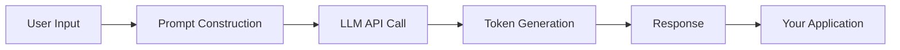

# Module 1 — What is Generative AI

**Estimated time: 1 hour**

---

## 1.1 The Big Picture

Before diving into specifics, establish a clear mental model.

**Traditional software** is deterministic. You write rules, conditions, and logic. Given the same input, you always get the same output.

**Generative AI** is probabilistic. You describe *what you want* in natural language. The model generates a response that is statistically likely to be useful — but not guaranteed to be correct.

```
TRADITIONAL SOFTWARE            GENERATIVE AI
─────────────────────           ──────────────────────
Input → Rules → Output          Input → Learned Patterns → Generated Output
       (you write rules)                (model learned from data)

Deterministic                   Probabilistic
Explicit logic                  Implicit knowledge
Brittle at edge cases           Flexible but can hallucinate
```

---

## 1.2 How Generative AI Differs from Traditional ML

Traditional ML is also a form of AI — but there's a crucial difference in what each does.

```
TRADITIONAL ML                  GENERATIVE AI (LLMs)
────────────────────────        ────────────────────────────────
Classification / Prediction     Generation (text, code, images)
Spam? Yes/No                    "Write me an email about X"
Price = $342                    "Explain this code to me"
Category = Sports               "Summarize this document"

Narrow task                     Broad, general-purpose
Fixed output type               Open-ended output
Trained for one job             One model, many jobs
```

The key shift with Large Language Models (LLMs) is that a **single model trained on massive amounts of text can perform virtually any language task**. This eliminated the need to build custom models for every use case.

---

## 1.3 Why LLMs Changed Software Development

For decades, building an AI feature required:
- A dedicated ML engineer
- Custom training data
- Model training infrastructure
- Weeks or months of work

With LLMs, a software developer can:
- Write a prompt in plain English
- Call an API
- Get a useful result in minutes

This democratized AI development. LLMs are essentially **intelligence as a service**.

```
BEFORE LLMs                         AFTER LLMs
─────────────────────────────       ──────────────────────────────
Need: Custom NLP model              Need: API key + prompt
Time: Weeks                         Time: Hours
Skill: ML Engineering               Skill: Prompt design + API integration
Infra: Training cluster             Infra: REST call
Maintenance: Retrain on drift       Maintenance: Tune prompts
```

---

## 1.4 The Core Pipeline

Every GenAI interaction follows the same fundamental flow:



That's it at the highest level. The complexity lies in *what happens inside each of these boxes* and how you structure them for real applications.

---

## 1.5 Key Terminology

These are the terms you'll encounter constantly. Understand them now.

---

### Tokens

**The atomic unit of text for an LLM.**

LLMs don't process characters or words — they process tokens. A token is roughly 3–4 characters, or about 0.75 words.

```
Text:    "Hello, developer!"
Tokens:  ["Hello", ",", " developer", "!"]

Text:    "artificial intelligence"
Tokens:  ["art", "ificial", " intel", "ligence"]
```

Why does this matter?
- **Cost:** APIs charge by tokens consumed (input + output)
- **Limits:** Every model has a maximum token capacity (the context window)
- **Speed:** More tokens = slower and more expensive responses

**Rule of thumb:** 1,000 tokens ≈ 750 words ≈ 1.5 pages of text

---

### Prompts

**The input you send to an LLM.**

A prompt is any text you send to the model. It can include:
- Instructions
- Context / background information
- Examples of desired behavior
- The user's actual question

```
┌─────────────────────────────────────────────┐
│                   PROMPT                    │
│                                             │
│  [System Instructions]                      │
│  You are a helpful SQL expert.              │
│                                             │
│  [Context]                                  │
│  The database has tables: orders, users     │
│                                             │
│  [User Question]                            │
│  How many users placed orders last month?   │
└─────────────────────────────────────────────┘
```

---

### Temperature

**Controls how creative (or random) the model's output is.**

Temperature is a number between 0 and 1 (or sometimes 0–2).

```
Temperature = 0.0          Temperature = 0.7          Temperature = 1.0+
─────────────────          ─────────────────          ────────────────────
Deterministic              Balanced                   Creative / random
Same output each time      Some variation             High variation
Best for: code, SQL        Best for: chat, Q&A        Best for: creative writing
```

**Practical rule:**
- Use **low temperature (0–0.2)** when you need precise, factual, or structured outputs (code, SQL, JSON)
- Use **medium temperature (0.5–0.8)** for conversational or general-purpose tasks
- Use **high temperature** only for creative or brainstorming tasks

---

### Hallucinations

**When the model generates confident but factually wrong information.**

This is one of the most important concepts to internalize as a developer.

LLMs don't "look up" facts — they generate text that *looks like* a correct answer based on patterns learned during training. When the model doesn't know something, it doesn't say "I don't know" — it generates a plausible-sounding answer that may be completely fabricated.

```
HALLUCINATION EXAMPLES
─────────────────────────────────────────────────────────
User: "What is the CEO of Acme Corp?"
LLM:  "John Smith has been the CEO since 2019..."
      [John Smith may not exist — the model made this up]

User: "Summarize RFC 9999"
LLM:  "RFC 9999 defines the protocol for..."
      [RFC 9999 may not exist — model filled in plausible content]
```

**Why this happens:** LLMs optimize for *plausibility*, not *accuracy*. They are pattern-completion engines, not fact databases.

**How developers mitigate this:** RAG (Module 4), grounding, and output validation.

---

### Context Window

**The maximum amount of text an LLM can "see" at once.**

The context window is the total token budget for a single LLM call — input + output combined.

```
┌───────────────────────────────────────────────────┐
│                  CONTEXT WINDOW                   │
│              (e.g., 128,000 tokens)               │
│                                                   │
│  ┌─────────────┐ ┌──────────────┐ ┌───────────┐  │
│  │   System    │ │  Retrieved   │ │   User    │  │
│  │  Prompt     │ │  Documents   │ │  Question │  │
│  │  (500 tok)  │ │ (20k tokens) │ │ (200 tok) │  │
│  └─────────────┘ └──────────────┘ └───────────┘  │
│                                                   │
│  ←─────────────── INPUT ──────────────────────→  │
│                                        ┌────────┐ │
│                                        │ OUTPUT │ │
│                                        │(2k tok)│ │
│                                        └────────┘ │
└───────────────────────────────────────────────────┘
```

**Common context window sizes:**
- GPT-4o: 128K tokens
- Claude Sonnet: 200K tokens
- Gemini 1.5 Pro: 1M tokens

The larger the context window, the more information you can give the model — but larger contexts also increase cost and can reduce response quality (the "lost in the middle" problem).

---

## Key Takeaways — Module 1

- GenAI generates content; traditional ML classifies or predicts
- LLMs turned AI into an API call — democratizing development
- Tokens are the unit of measurement for cost and limits
- Temperature controls output randomness — tune it to your use case
- Hallucination is fundamental to how LLMs work — design around it
- The context window is your working memory — manage it carefully

---

**Next:** [Module 2 — How LLMs Work](./module-02-how-llms-work.md)