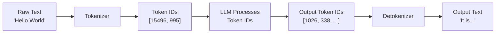
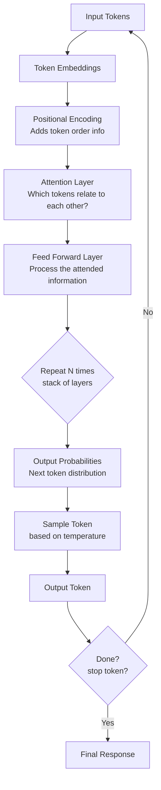

# Module 2 — How LLMs Work (Conceptual for Developers)

**Estimated time: 1.5 hours**

> You don't need to understand the math. You need to understand the mental model.

---

## 2.1 The Core Intuition

An LLM is trained on a massive amount of text and learns one thing extremely well:

**Given this sequence of text, what token is most likely to come next?**

That's it. Everything else — reasoning, coding, summarization, translation — emerges from doing this one thing with enough data and enough parameters.

```
Training:
"The capital of France is ___"  →  learns "Paris" is highly likely next

Inference:
"Explain recursion to a 5 year old" → generates tokens one by one
that form a coherent, plausible explanation
```

---

## 2.2 Tokenization

Before any text reaches the model, it must be converted to tokens.



**Tokenizers are model-specific.** GPT-4 uses a different tokenizer than Claude or Gemini. The same text will have different token counts across models.

**Why this matters for developers:**

```python
# This seems like one word but uses multiple tokens:
"authentication"   →  ["auth", "ent", "ication"]   # 3 tokens

# Code uses many tokens (each symbol is often its own token):
"if x > 0:"        →  ["if", " x", " >", " 0", ":"]  # 5 tokens
```

Code, non-English text, and special characters tend to use more tokens than English prose. Always test your prompts with a tokenizer tool to understand actual costs.

---

## 2.3 Embeddings

**Embeddings convert text into numbers that capture meaning.**

This is one of the most important concepts in the GenAI ecosystem. An embedding is a list of floating-point numbers (a vector) that represents the *semantic meaning* of a piece of text.

```
Text → Embedding (vector of numbers)
──────────────────────────────────────────────────────
"dog"        →  [0.21, -0.45, 0.87, 0.12, ...]  (1536 dimensions)
"puppy"      →  [0.23, -0.44, 0.85, 0.14, ...]  (similar!)
"cat"        →  [0.19, -0.40, 0.91, 0.08, ...]  (somewhat similar)
"SQL query"  →  [-0.72, 0.33, -0.12, 0.55, ...]  (very different)
```

The magic: **similar meaning → similar vectors → close in vector space**

```
                    Semantic Space

    puppy●   ●dog

           ●kitten
              ●cat


                                         ●database
                                         ●SQL
```

This is the foundation of semantic search and RAG systems.

**Two types of embeddings to know:**
1. **Text embeddings** — convert text to vectors (used for search/retrieval)
2. **Token embeddings** — internal to the LLM, how it represents each input token

---

## 2.4 Transformers (High-Level)

The transformer is the architecture that powers every modern LLM. You don't need to understand its mathematics, but you should understand what it does.

**The key innovation: Attention**

Before transformers, language models processed text sequentially — like reading one word at a time. Transformers can look at all tokens simultaneously and learn which ones are relevant to each other.

```
Sentence: "The bank by the river overflowed its banks"

Attention allows the model to learn:
- "bank" (word 2) relates to "river" (word 5) → means riverbank
- "banks" (word 9) also relates back to "river"
- NOT related to "financial bank"

Traditional model: reads left to right, loses context
Transformer: sees all words, understands relationships
```

**The Transformer pipeline (simplified):**



**Key insight for developers:** The model generates ONE token at a time, feeds it back in, and repeats. A 200-word response requires ~270 sequential steps. This is why streaming exists — users see output as it's generated.

---

## 2.5 The Token Generation Loop

Understanding this loop explains latency, streaming, and cost:

```
┌─────────────────────────────────────────────────────────┐
│                  TOKEN GENERATION LOOP                  │
│                                                         │
│  1. Receive full context (prompt + conversation so far) │
│     ↓                                                   │
│  2. Run full transformer forward pass                   │
│     ↓                                                   │
│  3. Get probability distribution over all ~50k tokens   │
│     ↓                                                   │
│  4. Sample one token (based on temperature)             │
│     ↓                                                   │
│  5. Append token to context                             │
│     ↓                                                   │
│  6. Repeat from step 1 until [STOP] token               │
│                                                         │
│  Each iteration = one token = ~10-30ms                  │
│  200 token response = ~2-6 seconds                      │
└─────────────────────────────────────────────────────────┘
```

**Implications:**
- **Prefill latency** (time to first token) = processing the full input prompt
- **Decode latency** (time per token) = roughly constant per token
- Long prompts → slower time-to-first-token
- Long outputs → longer total time (unavoidable)

---

## 2.6 Context Window Deep Dive

The context window determines what the model can "see" during any single inference call.

```
┌──────────────────────────────────────────────────────────────┐
│                     CONTEXT WINDOW                           │
│                                                              │
│  ┌──────────────┐                                            │
│  │    SYSTEM    │ ← Persistent instructions (your app logic) │
│  │    PROMPT    │                                            │
│  └──────────────┘                                            │
│  ┌──────────────┐                                            │
│  │  RETRIEVED   │ ← Documents injected for this query (RAG)  │
│  │   CONTEXT    │                                            │
│  └──────────────┘                                            │
│  ┌──────────────┐                                            │
│  │    CHAT      │ ← Previous messages in conversation        │
│  │   HISTORY    │                                            │
│  └──────────────┘                                            │
│  ┌──────────────┐                                            │
│  │     USER     │ ← Current user message                     │
│  │    INPUT     │                                            │
│  └──────────────┘                                            │
│  ┌──────────────┐                                            │
│  │   RESPONSE   │ ← Model generates this                     │
│  │  (generated) │                                            │
│  └──────────────┘                                            │
│                                                              │
│  Total must fit within window limit (e.g., 128K tokens)      │
└──────────────────────────────────────────────────────────────┘
```

**Critical limitation:** LLMs have NO memory between separate API calls. Each call is stateless. If you want the model to "remember" the conversation, you must include previous messages in every request.

```
Request 1:  [system] [user: "My name is Alice"]
Request 2:  [system] [assistant: "Nice to meet you Alice"] [user: "What's my name?"]
             ↑ You must re-send the full history every time
```

---

## 2.7 Token Cost Model

Understanding how you're charged helps you design efficient systems.

```
COST ANATOMY OF AN LLM CALL
─────────────────────────────────────────────────────────────
Input tokens  (everything you send)    = ~$0.003 per 1K tokens
Output tokens (everything generated)  = ~$0.015 per 1K tokens

(Approximate GPT-4o pricing as of 2025 — varies by model)

Output tokens are typically 3-5x more expensive than input tokens
─────────────────────────────────────────────────────────────

Example:
  System prompt:     500 tokens   (input)
  Retrieved docs:  5,000 tokens   (input)
  User question:     100 tokens   (input)
  ─────────────────────────────────────
  Total input:     5,600 tokens  = ~$0.017

  Response:          800 tokens   (output) = ~$0.012

  Total per request: ~$0.029
  At 10,000 requests/day = ~$290/day
```

**Cost optimization strategies (covered in Module 8):**
- Shorter system prompts
- Efficient chunking in RAG
- Response caching
- Smaller models for simpler tasks

---

## Key Takeaways — Module 2

- LLMs predict the next token — all capability emerges from this
- Tokenization is model-specific; code and non-English text use more tokens
- Embeddings are vectors that capture semantic meaning — foundation of search
- Transformers use attention to understand relationships between all tokens simultaneously
- Token generation is sequential and stateful within a call but stateless between calls
- You pay separately for input and output tokens — output is more expensive
- Managing context window size is a core engineering concern

---

**Next:** [Module 3 — Building Basic GenAI Applications](./module-03-building-basic-genai-apps.md)
