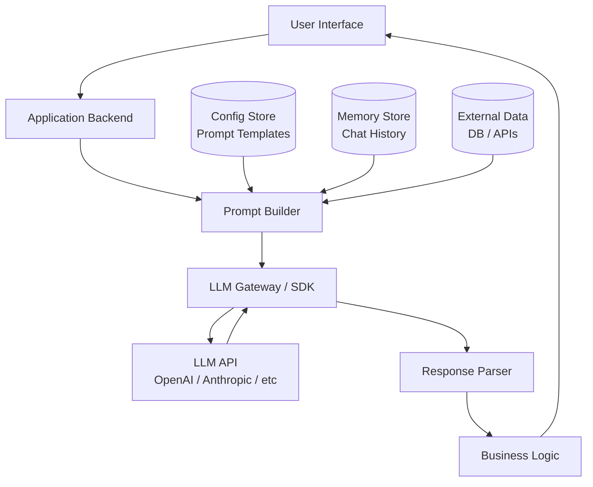
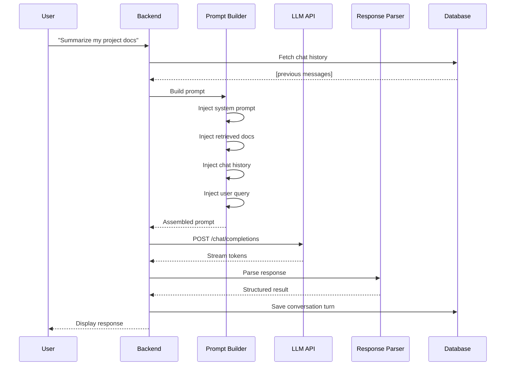
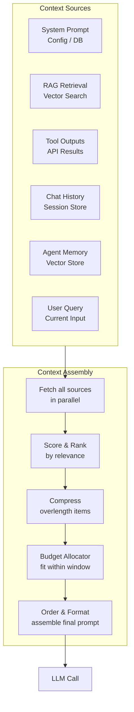

# Module 3 — Building Basic GenAI Applications

**Estimated time: 1.5 hours**

---

## 3.1 The Architecture of a GenAI App

A GenAI application isn't just "call the API and return the result." It's a system with several layers.



**Each layer has a job:**

| Layer | Responsibility |
|-------|----------------|
| Prompt Builder | Assembles system prompt + context + history + user input |
| LLM Gateway | Manages API keys, retries, rate limiting, model selection |
| Response Parser | Extracts structured data from model output |
| Memory Store | Persists conversation history across requests |

---

## 3.2 Prompt Engineering Basics

Prompt engineering is the practice of designing inputs that reliably get the outputs you want.

**The anatomy of a well-structured prompt:**

```
┌─────────────────────────────────────────────────────────┐
│ SYSTEM PROMPT (role + rules + output format)            │
│─────────────────────────────────────────────────────────│
│ You are a senior software engineer who reviews code for │
│ security vulnerabilities. Always respond with:          │
│ 1. A severity score (Critical/High/Medium/Low)          │
│ 2. The specific vulnerability found                     │
│ 3. A concrete fix                                       │
│ Be concise. No fluff.                                   │
├─────────────────────────────────────────────────────────┤
│ FEW-SHOT EXAMPLES (optional but powerful)               │
│─────────────────────────────────────────────────────────│
│ Example Input: [SQL code with injection]                │
│ Example Output: { severity: "Critical", vuln: "SQL      │
│ Injection via unsanitized input", fix: "Use prepared    │
│ statements..." }                                        │
├─────────────────────────────────────────────────────────┤
│ USER INPUT (the actual request)                         │
│─────────────────────────────────────────────────────────│
│ Review this code: [user's code here]                    │
└─────────────────────────────────────────────────────────┘
```

---

## 3.3 Core Prompting Techniques

### Zero-Shot Prompting
Just give instructions, no examples. Works for straightforward tasks.

```
"Translate the following text to Spanish: 'Hello, how are you?'"
```

### Few-Shot Prompting
Provide 2–5 examples of input → output pairs. Dramatically improves consistency.

```
"Classify the sentiment of these reviews:

Input: 'The product was amazing!' → Output: positive
Input: 'Worst purchase ever.'     → Output: negative
Input: 'It was okay, nothing special.' → Output: neutral

Now classify: 'Shipping was slow but the quality is great.'"
```

### Chain-of-Thought (CoT)
Ask the model to reason step by step before giving an answer. Improves accuracy for complex tasks.

```
"Analyze whether this API design follows REST principles.
Think step by step: first check the resource naming,
then the HTTP methods, then the response codes.
After reasoning through each, give your final verdict."
```

---

## 3.4 Prompt Templates

Never hardcode prompts in your application logic. Treat prompts like templates — parameterized, versioned, and testable.

```python
# Bad: Hardcoded prompt in business logic
def summarize(text):
    response = llm.call(f"Summarize this: {text}")
    return response

# Good: Parameterized prompt template
SUMMARIZE_TEMPLATE = """
You are a technical writer. Summarize the following content.
Format: 3 bullet points maximum. Each point max 20 words.
Audience: {audience}
Tone: {tone}

Content to summarize:
{content}
"""

def summarize(text, audience="developers", tone="concise"):
    prompt = SUMMARIZE_TEMPLATE.format(
        audience=audience,
        tone=tone,
        content=text
    )
    return llm.call(prompt)
```

**Why templates matter:**
- You can A/B test different prompts
- You can version control prompt changes
- You can reuse prompts across features
- You can externalize prompts to a config/database for hot-reloading

---

## 3.5 Structured Output

One of the most powerful patterns for building reliable GenAI apps. Instead of parsing free-form text, you instruct the model to respond with a specific schema.

**Problem with free-form output:**
```
Prompt: "Is this email spam?"
Response: "Based on my analysis, this email appears to be spam
because it contains suspicious links and urgency language."

# How do you reliably extract "yes/no" from this?
```

**Solution: Force structured output:**
```
Prompt: "Is this email spam? Respond ONLY with valid JSON:
{ 'is_spam': boolean, 'confidence': 0-1, 'reason': string }"

Response: { "is_spam": true, "confidence": 0.95,
            "reason": "Contains phishing link and urgency language" }
```

**Modern approach using function calling / structured outputs:**

```python
# Using Pydantic + Instructor library (or native structured outputs)
from pydantic import BaseModel
from typing import Literal

class SpamAnalysis(BaseModel):
    is_spam: bool
    confidence: float
    reason: str
    category: Literal["phishing", "marketing", "scam", "legitimate"]

# Model is constrained to return this exact structure
result: SpamAnalysis = llm.chat(
    messages=[...],
    response_model=SpamAnalysis
)
# result.is_spam, result.confidence are always valid Python objects
```

---

## 3.6 The Request/Response Flow in Full



---

## 3.7 Conversation Management

Building chat applications requires managing state explicitly since LLMs are stateless.

```
CONVERSATION MANAGEMENT PATTERN

Each request packages full conversation history:
─────────────────────────────────────────────────────────
Request N:
  messages: [
    { role: "system",    content: "You are a helpful assistant..." },
    { role: "user",      content: "What is Docker?" },
    { role: "assistant", content: "Docker is a containerization..." },
    { role: "user",      content: "How does it differ from VMs?" }  ← current
  ]
─────────────────────────────────────────────────────────
```

**The window management problem:**

Long conversations eventually exceed the context window. Strategies:

```
Strategy 1: Sliding Window
  Keep last N messages only
  Simple but loses early context

Strategy 2: Summarization
  Summarize old messages periodically
  "The user asked about Docker, VMs, and Kubernetes..."
  Good balance of cost vs. memory

Strategy 3: Semantic Retrieval
  Store all messages as embeddings
  Retrieve relevant past messages for each new query
  Most sophisticated, used in long-running agents
```

---

## 3.8 Context Engineering

> "The central job of a GenAI application developer is not writing prompts — it's engineering context."

If you internalize one mental model from this entire course, make it this: **every LLM call is determined entirely by what you put in the context window**. The model has no state, no memory, no awareness of your system beyond what you send in that single request.

**Context engineering** is the discipline of deciding:
- What information to include in the context
- What to exclude (cost, noise)
- How to order it (position matters)
- How to compress it (when it doesn't fit)

---

### What Context Is Made Of

```
┌──────────────────────────────────────────────────────────────────┐
│                    CONTEXT WINDOW (e.g. 128K)                    │
│                                                                  │
│  ┌──────────────────────────────────────────────────────────┐   │
│  │ SYSTEM PROMPT                                            │   │
│  │ Role, rules, output format, persona                      │   │
│  │ [STATIC — same for all requests]                         │   │
│  └──────────────────────────────────────────────────────────┘   │
│  ┌──────────────────────────────────────────────────────────┐   │
│  │ RETRIEVED DOCUMENTS (RAG)                                │   │
│  │ Relevant chunks from your knowledge base                 │   │
│  │ [DYNAMIC — changes per query]                            │   │
│  └──────────────────────────────────────────────────────────┘   │
│  ┌──────────────────────────────────────────────────────────┐   │
│  │ TOOL OUTPUTS                                             │   │
│  │ Results from tool calls in the current session           │   │
│  │ [DYNAMIC — accumulates during agent runs]                │   │
│  └──────────────────────────────────────────────────────────┘   │
│  ┌──────────────────────────────────────────────────────────┐   │
│  │ CONVERSATION HISTORY                                     │   │
│  │ Previous turns in the current session                    │   │
│  │ [DYNAMIC — grows over time, needs trimming]              │   │
│  └──────────────────────────────────────────────────────────┘   │
│  ┌──────────────────────────────────────────────────────────┐   │
│  │ AGENT MEMORY                                             │   │
│  │ Relevant facts retrieved from long-term memory store     │   │
│  │ [DYNAMIC — pulled from vector store per query]           │   │
│  └──────────────────────────────────────────────────────────┘   │
│  ┌──────────────────────────────────────────────────────────┐   │
│  │ USER QUERY                                               │   │
│  │ The current user input / task                            │   │
│  │ [DYNAMIC — changes every request]                        │   │
│  └──────────────────────────────────────────────────────────┘   │
│                                                                  │
│  [RESPONSE GENERATED HERE — consumes the remaining budget]       │
└──────────────────────────────────────────────────────────────────┘
```

---

### The Context Assembly Pipeline



---

### Context Prioritization

Not all context is equally important. Prioritize what goes in the window:

```
PRIORITY ORDER (highest → lowest)
─────────────────────────────────────────────────────────────────
1. System prompt         [Always include — defines behavior]
2. User's current query  [Always include — the actual task]
3. Most relevant RAG chunks [High priority — grounds the answer]
4. Recent conversation turns [Medium — immediate context]
5. Tool outputs          [Include only relevant ones]
6. Older conversation    [Low priority — trim first when full]
7. Agent memory facts    [Include if directly relevant]
─────────────────────────────────────────────────────────────────

Rule: When you must trim, trim from the bottom of this list first.
```

---

### Context Compression

When context is too large to fit, compress it rather than truncate it:

```
COMPRESSION STRATEGIES
─────────────────────────────────────────────────────────────────
Strategy 1: Summarize old conversation turns
  Before:  10 full messages (2,000 tokens)
  After:   "User asked about auth issues, we resolved JWT expiry" (30 tokens)

Strategy 2: Extract key facts from documents
  Before:  Full retrieved document (3,000 tokens)
  After:   Bullet-point summary of relevant facts (200 tokens)

Strategy 3: Deduplicate retrieved chunks
  Multiple chunks may contain the same fact
  Merge overlapping content before including

Strategy 4: Progressive context loading
  Start with minimal context
  Add more only if the LLM signals it needs it ("I need more info about X")
─────────────────────────────────────────────────────────────────
```

---

### The Position Problem

**Where you put information in the context matters.** Research shows LLMs perform best on information at the start and end of the context — the "lost in the middle" effect.

```
CONTEXT POSITIONING STRATEGY

┌────────────────────────────────────────────────────────────┐
│  POSITION: START                HIGH ATTENTION             │
│  Put: System prompt                                        │
│  Put: Most critical instructions                           │
├────────────────────────────────────────────────────────────┤
│  POSITION: MIDDLE               LOWER ATTENTION            │
│  Put: Background documents                                 │
│  Put: Older conversation turns                             │
│  Put: Supplementary context                                │
├────────────────────────────────────────────────────────────┤
│  POSITION: END                  HIGH ATTENTION             │
│  Put: Most relevant RAG chunks                             │
│  Put: User's current query (always last)                   │
└────────────────────────────────────────────────────────────┘
```

---

### Context Engineering in Practice

```python
class ContextAssembler:
    """Assembles the optimal context for each LLM call."""

    TOKEN_BUDGET = 100_000  # leave 28K for response

    def assemble(self, query: str, session_id: str) -> list[Message]:
        budget = self.TOKEN_BUDGET
        messages = []

        # 1. System prompt — always first, non-negotiable
        system = self.get_system_prompt()
        budget -= count_tokens(system)
        messages.append({"role": "system", "content": system})

        # 2. Retrieve and rank context
        rag_chunks = self.retrieve_chunks(query, k=10)
        reranked   = self.rerank(query, rag_chunks)[:3]  # top 3

        # 3. Get conversation history
        history    = self.get_history(session_id, max_turns=20)

        # 4. Allocate remaining budget
        rag_tokens  = count_tokens(reranked)
        hist_tokens = count_tokens(history)

        if rag_tokens + hist_tokens > budget * 0.8:
            # Compress: summarize oldest history first
            history = self.compress_history(history, target_tokens=budget * 0.3)

        # 5. Add context, history, then query (query always last)
        messages.append({"role": "user", "content": format_context(reranked)})
        messages.extend(history)
        messages.append({"role": "user", "content": query})

        return messages
```

---

## Key Takeaways — Module 3

- GenAI apps have distinct layers: prompt building, LLM gateway, response parsing
- Treat prompts as versioned, parameterized templates — not hardcoded strings
- Few-shot examples dramatically improve consistency for complex tasks
- Structured output (JSON schema / function calling) makes LLM responses reliably parseable
- LLMs are stateless — you manage conversation history by re-sending it every call
- **Context engineering is the core skill**: what you put in the window determines everything
- Prioritize context by importance — trim low-value content first when the window fills
- Position matters: put the most critical instructions at the start and end

---

**Next:** [Module 4 — Retrieval Augmented Generation (RAG)](./module-04-retrieval-augmented-generation.md)
