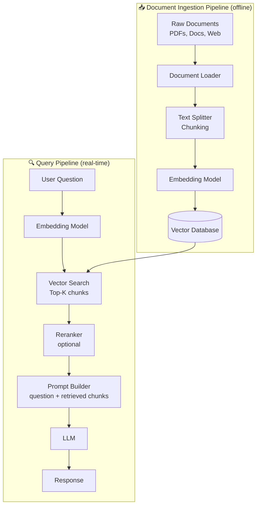
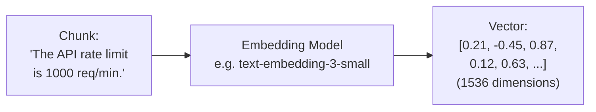
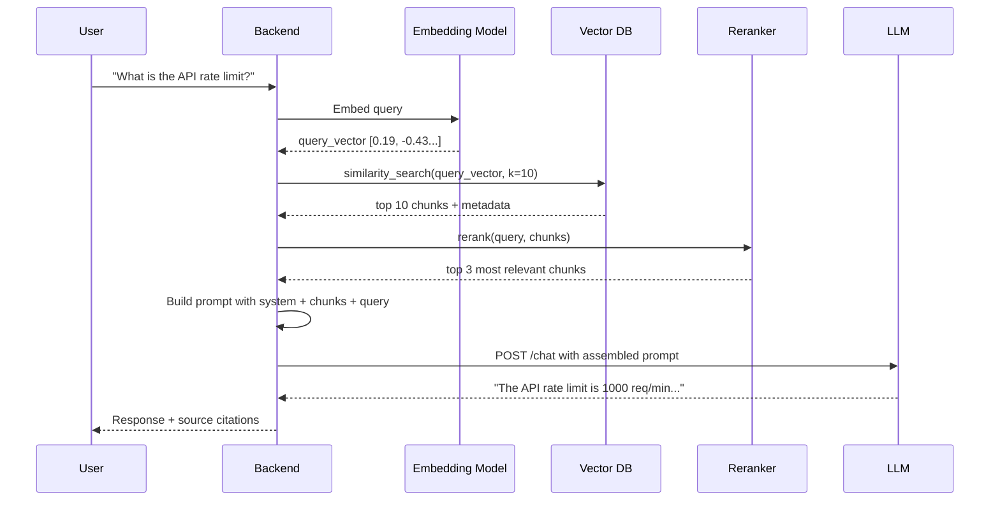

# Module 4 — Retrieval Augmented Generation (RAG)

**Estimated time: 2 hours**

> RAG is the most important architectural pattern in GenAI today. Every serious GenAI application uses it.

---

## 4.1 Why RAG Exists

LLMs have two fundamental problems for production applications:

**Problem 1: Knowledge cutoff**
```
LLM trained on data up to: October 2023
User asks: "What changed in our API last week?"
LLM: [cannot know this — it happened after training]
```

**Problem 2: Hallucination on specific facts**
```
LLM knows: General patterns about software companies
User asks: "What is the refund policy for Acme Corp?"
LLM: [generates a plausible-sounding policy — probably wrong]
```

**The RAG solution:** Before asking the LLM a question, *retrieve relevant documents from your own knowledge base* and include them in the prompt. Now the LLM has real, current information to reason over.

```
WITHOUT RAG                     WITH RAG
──────────────────              ─────────────────────────────────────
User: "Refund policy?"          User: "Refund policy?"

LLM: [guesses]                  Retrieve: [fetches actual policy doc]
                                Prompt: "Given this policy: [doc]
                                         What is the refund policy?"
                                LLM: [accurately describes real policy]
```

---

## 4.2 RAG Architecture Overview



Two separate pipelines:
1. **Ingestion** — runs once (or on update). Processes your documents and stores them.
2. **Query** — runs on every user request. Retrieves relevant chunks and generates a response.

---

## 4.3 The Ingestion Pipeline

### Step 1: Document Loading

```
Supported sources:
├── PDFs                  → extract text (beware of tables, images)
├── Word/Excel            → parse structured content
├── Web pages             → scrape and clean HTML
├── Markdown files        → structured content
├── Databases             → query and format records
└── Code repositories     → parse by file and function
```

### Step 2: Chunking

**The most underrated decision in RAG design.**

You cannot embed an entire document as one unit — you need to split it into manageable pieces that can be individually retrieved.

```
CHUNKING STRATEGIES
─────────────────────────────────────────────────────────────
Fixed Size:
  Split every N characters (e.g., 1000 chars)
  Simple but may cut mid-sentence

Sentence/Paragraph:
  Split at natural boundaries
  Better semantics, variable sizes

Recursive:
  Try splitting by paragraphs → sentences → words
  LangChain's default — good general-purpose choice

Semantic:
  Use embeddings to find natural topic breaks
  Best quality, more compute required

Document-Specific:
  Split code by functions
  Split PDFs by page/section
  Split tables row by row
  Always match splitter to content type
─────────────────────────────────────────────────────────────
```

**The overlap trick:**
```
Chunk 1: "...The API rate limit is 1000 req/min..."
Chunk 2: "...rate limit is 1000 req/min. Exceeding this..."
          ↑ overlap

Overlapping ensures concepts that span chunk boundaries
aren't lost during retrieval.
```

**Chunk size tradeoffs:**
```
Small chunks (256 tokens):
  ✓ Precise retrieval
  ✗ May lack context to be useful

Large chunks (2048 tokens):
  ✓ Rich context
  ✗ May include irrelevant content, costs more

Sweet spot: 512–1024 tokens with 10–20% overlap
```

### Step 3: Embedding

Each chunk is converted to a vector using an embedding model.



**Embedding models to know:**

| Model | Dimensions | Use case |
|-------|-----------|----------|
| OpenAI text-embedding-3-small | 1536 | General purpose, cheap |
| OpenAI text-embedding-3-large | 3072 | Better quality, more expensive |
| Cohere embed-v3 | 1024 | Strong multilingual |
| nomic-embed-text | 768 | Open source, self-hostable |

**Key rule:** The embedding model used during ingestion must be the same model used during query time.

### Step 4: Vector Storage

The vectors are stored in a Vector Database alongside the original chunk text and metadata.

```
WHAT GETS STORED IN THE VECTOR DB

For each chunk:
┌─────────────────────────────────────────────────────────┐
│ id:        "chunk_abc123"                               │
│ vector:    [0.21, -0.45, 0.87, ...]    ← for searching  │
│ content:   "The API rate limit is 1000 req/min..."      │
│ metadata:  {                                            │
│   source:   "api_docs.pdf",                             │
│   page:     12,                                         │
│   section:  "Rate Limiting",                            │
│   date:     "2024-01-15"                                │
│ }                                                       │
└─────────────────────────────────────────────────────────┘
```

---

## 4.4 The Query Pipeline

### Step 1: Embed the User Query

```python
user_query = "What is the API rate limit?"
query_vector = embedding_model.embed(user_query)
# query_vector = [0.19, -0.43, 0.89, ...]
```

### Step 2: Vector Search (Similarity Search)

Find the K chunks most similar to the query vector using cosine similarity or dot product.

```
VECTOR SEARCH VISUALIZATION

Query vector: [0.19, -0.43, 0.89, ...]

                   vector space

    ●chunk_abc123  ← distance: 0.02  (VERY SIMILAR - retrieved)
    ●chunk_def456  ← distance: 0.05  (similar - retrieved)
    ●chunk_ghi789  ← distance: 0.08  (similar - retrieved)

    ...100s of other chunks...

    ●chunk_xyz999  ← distance: 0.87  (unrelated - not retrieved)
    ●chunk_zzz111  ← distance: 0.91  (unrelated - not retrieved)
```

### Step 3: Reranking (Optional but Powerful)

Vector search finds *semantically similar* chunks but not always the *most relevant* ones. Reranking uses a more powerful cross-encoder model to re-score the top-K results.

```
RETRIEVAL WITHOUT RERANKING               WITH RERANKING
────────────────────────────────          ─────────────────────────────────
Vector Search returns top 10:             Reranker re-scores top 10:
  1. chunk about rate limits ✓              1. chunk about rate limits ✓
  2. chunk about API overview              2. chunk about rate limit errors
  3. chunk about authentication            3. chunk about quota management
  4. chunk about rate limit errors         4. chunk about API overview
  5. ...                                   ...

Top 3 sent to LLM (possibly noisy)       Top 3 sent to LLM (much better)
```

Rerankers are slower but significantly improve answer quality. Use them for high-stakes retrievals.

### Step 4: Prompt Construction and LLM Call

```
FINAL PROMPT STRUCTURE IN RAG
─────────────────────────────────────────────────────────────
System: You are a helpful documentation assistant.
        Answer questions based ONLY on the provided context.
        If the answer isn't in the context, say so clearly.
        Do not make up information.

Context:
---
[chunk 1]: "The API rate limit is 1000 requests per minute
            per API key. Enterprise plans have higher limits."
---
[chunk 2]: "Rate limit errors return HTTP 429. Implement
            exponential backoff for retry logic."
---
[chunk 3]: "You can monitor your rate limit usage in the
            developer dashboard under Usage → API."
---

User Question: What is the API rate limit and how do I handle errors?
─────────────────────────────────────────────────────────────
```

---

## 4.5 Full RAG Flow — End to End



---

## 4.6 Advanced RAG Patterns

### Hybrid Search
Combine vector search (semantic) with keyword search (BM25) for better retrieval.

```
USER QUERY: "JWT authentication error 401"

Vector Search: finds semantically similar content
  → "Authentication failed when token expires..."

Keyword Search: finds exact term matches
  → "JWT: invalid signature - returns 401 Unauthorized"

Hybrid: BOTH results merged and reranked
  → Best of both worlds
```

### Metadata Filtering
Use document metadata to narrow the search space before semantic search.

```python
# Without filtering: searches all 500,000 chunks
results = vector_db.search(query_vector, k=5)

# With filtering: searches only this year's docs for this product
results = vector_db.search(
    query_vector,
    filter={"product": "API-v2", "year": 2024},
    k=5
)
# Faster, more relevant, less noise
```

### Query Rewriting
Improve retrieval by rewriting the user's query into a better search query.

```
User says:       "It doesn't work with my account"
                   ↓  LLM rewrites for better retrieval
Better query:    "account authentication error troubleshooting"
```

---

## 4.7 When to Use RAG vs. Fine-tuning

```
USE RAG WHEN:                          USE FINE-TUNING WHEN:
────────────────────────────────       ────────────────────────────────
Your data changes frequently           You need a specific style/tone
You need source citations              You need a specific output format
You have large amounts of data         You need very consistent behavior
You need to filter/scope info          Your task is very narrow
You want updatable knowledge           You have lots of training examples
You need auditability                  Latency is critical (no retrieval)

RAG is almost always preferred for knowledge-based applications.
Fine-tuning is preferred for behavior/style modification.
```

---

## Key Takeaways — Module 4

- RAG solves the knowledge cutoff and hallucination problem by grounding LLMs in real data
- The ingestion pipeline (load → chunk → embed → store) runs offline
- The query pipeline (embed → search → rerank → generate) runs in real-time
- Chunking strategy is one of the highest-leverage decisions in RAG quality
- Use overlap between chunks to avoid losing context at boundaries
- Reranking significantly improves retrieval quality at modest cost
- Hybrid search (semantic + keyword) usually beats pure vector search
- Metadata filtering dramatically improves relevance and speed for large knowledge bases

---

**Next:** [Module 5 — Agentic AI Systems](./module-05-agentic-ai-systems.md)
