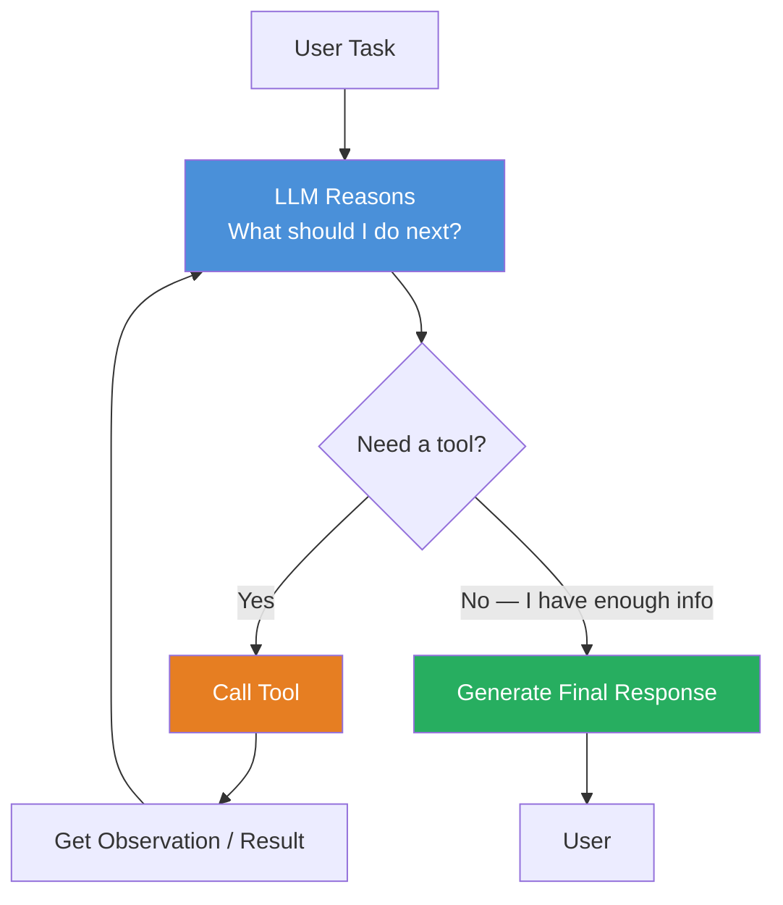
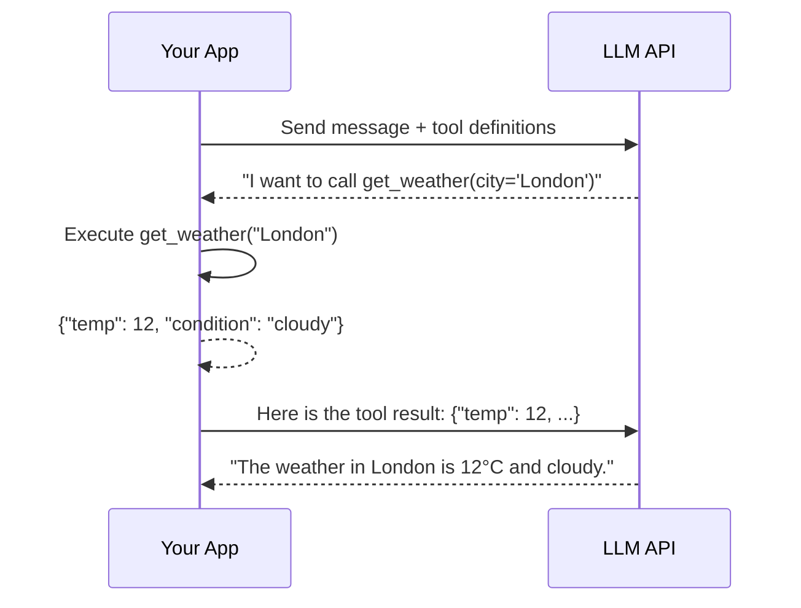
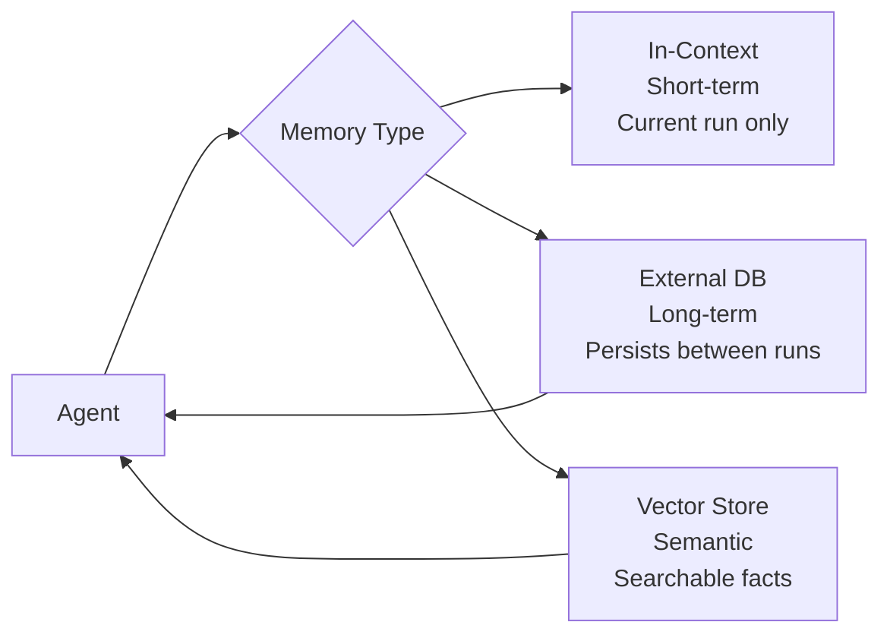
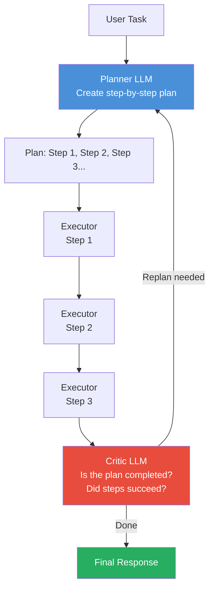

# Module 5 — Agentic AI Systems

**Estimated time: 2 hours**

> This is where GenAI stops being a chat interface and starts being an autonomous system.

---

## 5.1 What is an Agent?

An LLM is a text-in, text-out system. An agent is an LLM that can:
1. **Reason** about what to do
2. **Take actions** in the world (via tools)
3. **Observe** the results
4. **Repeat** until the task is complete

```
LLM (not agentic)              AGENT (agentic)
───────────────────────────    ──────────────────────────────────
User: "What is the stock       User: "Should I buy AAPL today?"
price of AAPL?"

LLM: [can only guess —         Agent:
      no internet access]      1. Thinks: "I need current price"
                               2. Calls: get_stock_price("AAPL")
                               3. Sees:  $187.32, up 2.3%
                               4. Calls: get_news("AAPL", days=7)
                               5. Sees:  "Earnings beat estimates"
                               6. Calls: get_analyst_ratings("AAPL")
                               7. Thinks: "Buy consensus, positive news"
                               8. Responds: "Based on current data..."
```

The agent loop is what transforms an LLM from a static oracle into a dynamic, task-completing system.

---

## 5.2 The Agent Loop

The core pattern of every AI agent:



Each iteration of the loop:
1. **Think** — LLM reasons about current state and decides next action
2. **Act** — Call a tool with specific parameters
3. **Observe** — Receive the tool's output
4. **Repeat** — Feed observation back to LLM, continue reasoning

This loop continues until the LLM decides it has enough information to answer, or hits a maximum iteration limit.

---

## 5.3 Tools — The Foundation of Agency

A **tool** is any function an LLM can call. The LLM doesn't execute the function — your application does. The LLM just decides *which tool to call* and *with what parameters*.

```
TOOL DEFINITION (what you give the LLM):
─────────────────────────────────────────────────────────────
{
  "name": "get_weather",
  "description": "Get current weather for a city. Use this when
                  the user asks about weather conditions.",
  "parameters": {
    "city": "string — the city name",
    "unit": "string — 'celsius' or 'fahrenheit'"
  }
}
─────────────────────────────────────────────────────────────

LLM decides to call it:
{"tool": "get_weather", "city": "London", "unit": "celsius"}

Your app executes the actual API call and returns result.

LLM receives result and continues.
```

**Common tool categories:**

```
DATA ACCESS                    COMPUTATION               ACTIONS
─────────────────              ────────────────          ────────────────────
search_web()                   run_python()              send_email()
query_database()               calculate()               create_ticket()
read_file()                    run_sql()                 post_message()
get_api_data()                 run_tests()               update_record()
search_knowledge_base()        parse_document()          deploy_code()
get_user_profile()             generate_chart()          book_meeting()
```

---

## 5.4 Function Calling (Tool Use API)

Modern LLM APIs have native support for tool calling. This is more reliable than asking the model to output JSON you then parse.



**How the API interaction looks:**

```python
tools = [{
    "type": "function",
    "function": {
        "name": "get_weather",
        "description": "Get current weather for a city",
        "parameters": {
            "type": "object",
            "properties": {
                "city": {"type": "string"},
                "unit": {"type": "string", "enum": ["celsius", "fahrenheit"]}
            },
            "required": ["city"]
        }
    }
}]

# Step 1: Ask with tools available
response = client.chat.completions.create(
    model="gpt-4o",
    messages=[{"role": "user", "content": "What's the weather in London?"}],
    tools=tools
)

# Step 2: LLM returns a tool call request
tool_call = response.choices[0].message.tool_calls[0]
# tool_call.function.name = "get_weather"
# tool_call.function.arguments = '{"city": "London", "unit": "celsius"}'

# Step 3: Execute tool
result = get_weather(city="London", unit="celsius")

# Step 4: Return result to LLM
messages.append({"role": "tool", "content": str(result), "tool_call_id": tool_call.id})
final_response = client.chat.completions.create(model="gpt-4o", messages=messages)
```

---

## 5.5 The ReAct Pattern

**ReAct** (Reasoning + Acting) is the most widely used agent pattern. The model explicitly reasons before acting.

```
REACT TRACE EXAMPLE
User: "How many employees does Stripe have, and what's their latest funding?"

Thought: I need to find Stripe's employee count. Let me search for that.
Action: search_web("Stripe employee count 2024")
Observation: "Stripe has approximately 8,000 employees as of 2024"

Thought: Good. Now I need their latest funding round.
Action: search_web("Stripe latest funding round 2024")
Observation: "Stripe raised $694M at $65B valuation in March 2024"

Thought: I now have both pieces of information needed.
Action: [no more tools needed]

Final Answer: Stripe has approximately 8,000 employees. Their latest
funding was a $694M round in March 2024, valuing the company at $65B.
```

The explicit "Thought" step significantly improves accuracy — the model is forced to reason about *why* it's taking each action.

---

## 5.6 Agent Memory

Unlike a simple chatbot, agents need to remember information across multiple tool calls and sessions.

```
TYPES OF AGENT MEMORY
─────────────────────────────────────────────────────────────
In-Context Memory (short-term):
  The conversation and tool call history within one run
  Lost when context window is full
  Fastest, no infrastructure needed

External Memory (long-term):
  Stored in database/vector store between runs
  "User prefers Python over JavaScript"
  "Last time we ran this workflow, step 3 failed"

Episodic Memory:
  Records of past task executions
  "Task X was completed with steps [A, B, C]"
  Enables learning from past runs

Semantic Memory:
  Facts and knowledge the agent has accumulated
  Stored as embeddings, retrieved via similarity search
─────────────────────────────────────────────────────────────
```



---

## 5.7 Task Decomposition and Planning

For complex tasks, the agent needs to break the problem into subtasks before executing.

```
COMPLEX TASK DECOMPOSITION

User: "Analyze our product reviews from last quarter,
       identify top complaints, and draft response templates"

Agent Plan:
┌────────────────────────────────────────────────────────┐
│ Step 1: Query database for Q3 product reviews          │
│   Tool: query_database("SELECT * FROM reviews ...")    │
│                                                        │
│ Step 2: Cluster reviews by topic/complaint type        │
│   Tool: analyze_sentiment_clusters(reviews)            │
│                                                        │
│ Step 3: Rank clusters by frequency and severity        │
│   Tool: calculate_stats(clusters)                      │
│                                                        │
│ Step 4: Draft response templates for top 5 complaints  │
│   Tool: [LLM reasoning — no tool needed]               │
│                                                        │
│ Step 5: Format output as structured report             │
│   Tool: format_report(templates)                       │
└────────────────────────────────────────────────────────┘
```

---

## 5.8 Plan-and-Execute Pattern

A more structured approach than ReAct for complex multi-step tasks:



**When to use each pattern:**

| Pattern | Best For |
|---------|----------|
| ReAct | Dynamic, exploratory tasks where next steps depend on results |
| Plan-and-Execute | Complex, predictable multi-step tasks |
| Reflexion | Tasks where self-critique improves quality |

---

## 5.9 Agent Design Considerations

**Determinism vs. Flexibility:**
```
HIGH STRUCTURE (deterministic)     HIGH FLEXIBILITY (autonomous)
──────────────────────────────     ──────────────────────────────
Predefined workflow steps          Agent decides all steps
Specific tools per step            Agent picks any available tool
Predictable execution path         Dynamic execution path
Easier to debug                    Harder to predict/debug
Limited to designed scenarios      Handles novel situations
Good for production critical tasks Good for research/exploration tasks
```

**Guardrails:**
- Always set a maximum iteration limit (prevent infinite loops)
- Scope available tools (don't give an agent more tools than it needs)
- Validate tool inputs before execution
- Log every tool call for debugging and audit

```
AGENT SAFETY PATTERN
─────────────────────────────────────────────────────────────
1. Tool whitelist — only defined tools are callable
2. Input validation — validate all tool parameters
3. Max iterations — stop after N steps (e.g., 20)
4. Human-in-the-loop — confirm before destructive actions
5. Full trace logging — every thought, action, observation
6. Timeout — kill if running too long
─────────────────────────────────────────────────────────────
```

---

## Key Takeaways — Module 5

- Agents combine LLM reasoning with tool execution in a loop
- The agent loop: Think → Act → Observe → Repeat
- Tools are functions you define; the LLM decides when and how to call them
- ReAct (explicit reasoning before acting) is the most reliable baseline pattern
- Agent memory has multiple types: in-context, external (long-term), semantic (vector)
- Always constrain agents: max iterations, tool scope, input validation, logging
- Task decomposition enables agents to tackle complex multi-step problems

---

**Next:** [Module 6 — Multi-Agent and Workflow Systems](./module-06-multi-agent-workflow-systems.md)
