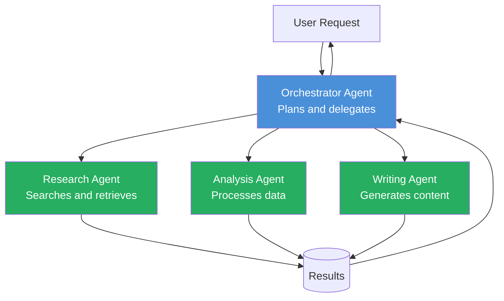
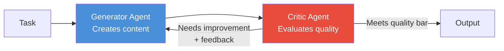
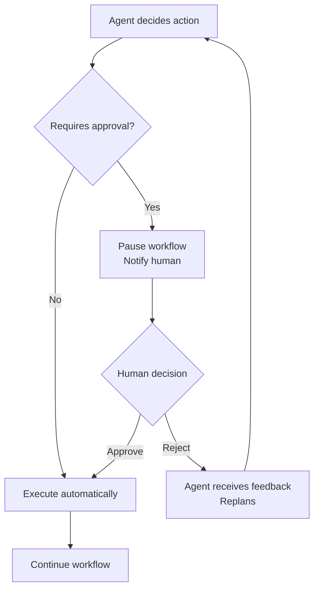
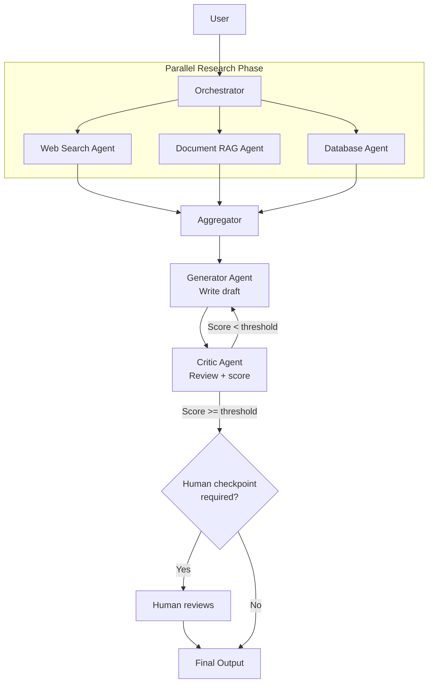

# Module 6 — Multi-Agent and Workflow Systems

**Estimated time: 1 hour**

---

## 6.1 Why Multi-Agent?

A single agent has limits:
- Context window fills up on long tasks
- One LLM can't be expert at everything simultaneously
- Complex workflows benefit from specialization and parallelism

Multi-agent systems assign specialized roles to different agents and coordinate their work.

```
SINGLE AGENT                    MULTI-AGENT
───────────────────────────     ────────────────────────────────────────
One LLM does everything         Specialized agents per task
Limited parallelism             Parallel execution of subtasks
Generalist                      Expert agents per domain
Context window fills fast       Each agent has focused context
Hard to debug large tasks       Modular, easier to isolate failures
```

---

## 6.2 Core Multi-Agent Patterns

### Pattern 1: Orchestrator + Workers

The most common pattern. One orchestrator agent breaks down work and delegates to specialist workers.



### Pattern 2: Pipeline (Assembly Line)

Each agent transforms the output and passes it to the next.

```
Input → Agent A → Agent B → Agent C → Output

Example: Document Processing Pipeline
Raw PDF
  → [Extractor Agent]  → Structured text
  → [Summarizer Agent] → Key points
  → [Classifier Agent] → Category + tags
  → [Formatter Agent]  → Final JSON
```

### Pattern 3: Critic / Evaluator Loop

A generator and a critic iterate to improve quality.



This pattern dramatically improves output quality for complex generation tasks (code, reports, plans).

---

## 6.3 Agent Communication

Agents communicate via structured messages. Each message passes through a shared state or message bus.

```
AGENT MESSAGE PROTOCOL

{
  from:    "orchestrator",
  to:      "research_agent",
  type:    "task",
  task_id: "task_abc123",
  payload: {
    instruction: "Find the latest pricing for AWS S3 storage",
    constraints: {
      max_sources: 3,
      recency:     "last 30 days"
    }
  }
}
```

**Shared State Pattern:**
```
                    ┌─────────────────────┐
                    │     SHARED STATE    │
                    │  {                  │
                    │    task: "...",     │
Agent 1 ────────→  │    step1: "done",   │  ←──── Agent 2
                    │    step2: "running",│
Agent 3 ────────→  │    results: {...}   │  ←──── Agent 4
                    │  }                  │
                    └─────────────────────┘
```

---

## 6.4 Orchestration Frameworks

You don't need to build multi-agent coordination from scratch.

```
FRAMEWORK COMPARISON
─────────────────────────────────────────────────────────────────────
LangGraph
  Model:      Graph-based state machine
  Strengths:  Complex conditional workflows, human-in-the-loop
  Use when:   Workflows with branching logic

CrewAI
  Model:      Role-based agent crews with goals
  Strengths:  Easy to define agent personas and workflows
  Use when:   Task delegation across specialized roles

AutoGen (Microsoft)
  Model:      Conversational agents that message each other
  Strengths:  Natural-language agent coordination
  Use when:   Research agents, code generation/review cycles

OpenAI Swarm
  Model:      Lightweight agent handoff
  Strengths:  Simple, minimal abstraction
  Use when:   Sequential handoff patterns
─────────────────────────────────────────────────────────────────────
```

---

## 6.5 Human-in-the-Loop

For high-stakes actions, agents should pause and request human confirmation.



**When to require human approval:**
- Actions that are irreversible (delete, send email, deploy)
- Actions above a cost threshold
- Actions outside the agent's configured scope
- When agent confidence is below a threshold

---

## 6.6 Full Multi-Agent Architecture Example



---

## Key Takeaways — Module 6

- Multi-agent systems enable specialization, parallelism, and scale beyond single-agent limits
- Orchestrator + Workers is the most versatile and common pattern
- Generator + Critic loops significantly improve output quality
- Use shared state or message passing for agent coordination
- LangGraph, CrewAI, AutoGen are production-ready frameworks — don't build from scratch
- Always design human-in-the-loop checkpoints for irreversible or high-stakes actions

---

**Next:** [Module 7 — The GenAI Stack for Developers](./module-07-genai-stack-for-developers.md)
