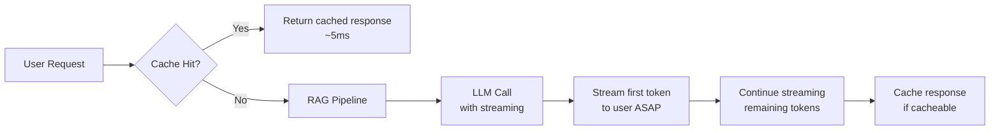
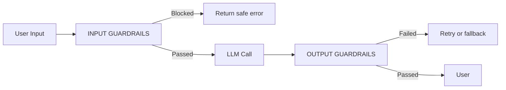
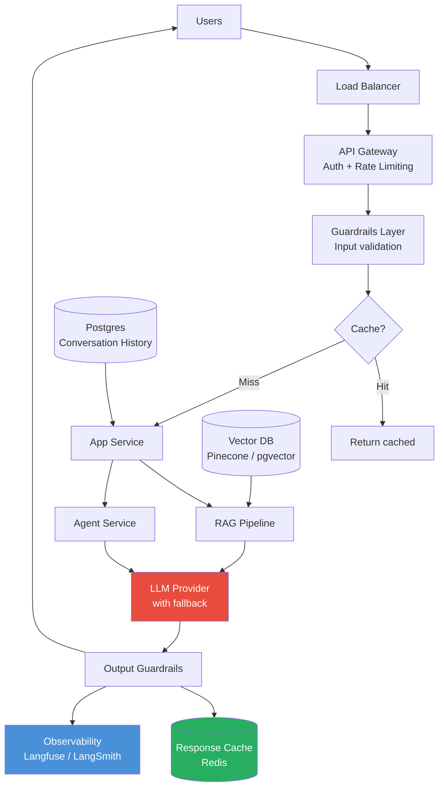

# Module 8 — Production Considerations

**Estimated time: 1 hour**

---

## 8.1 The Production Reality

Development and production GenAI systems are very different:

```
DEVELOPMENT                     PRODUCTION
───────────────────────────     ──────────────────────────────────────
Single user                     Thousands of concurrent users
Free API limits                 Token costs add up fast
Hallucinations are interesting  Hallucinations are business risk
Slow response is okay           Latency directly impacts UX
No logging needed               Full audit trail required
Simple prompts                  Versioned, tested prompt pipeline
No evaluation                   Continuous evaluation + monitoring
```

---

## 8.2 Latency Optimization



**Latency reduction strategies:**

```
STRATEGY                    IMPACT          COMPLEXITY
───────────────────────────────────────────────────────────
Response caching            Very High       Low
Streaming responses         High (UX)       Low
Smaller/faster models       High            Low
Parallel tool calls         High            Medium
Prompt compression          Medium          Medium
Semantic caching            Medium          Medium
Smaller chunks in RAG       Medium          Low
Model routing               High            High
───────────────────────────────────────────────────────────
```

**Response caching:**
```
WHAT TO CACHE                       WHAT NOT TO CACHE
─────────────────────────────────   ─────────────────────────────────
Static FAQs                         Personalized responses
Product documentation summaries     Time-sensitive information
Code explanations                   User-specific context
Generic how-to answers              Real-time data queries

Cache key: hash(system_prompt + user_query)
TTL: based on content freshness requirements
```

**Streaming:**
```python
# Always stream for interactive applications
# Users perceive streamed responses as faster even at same total time

stream = client.chat.completions.create(
    model="gpt-4o",
    messages=messages,
    stream=True
)

for chunk in stream:
    if chunk.choices[0].delta.content:
        yield chunk.choices[0].delta.content  # Send token to UI immediately
```

---

## 8.3 Token Cost Management

```
COST CONTROL HIERARCHY
─────────────────────────────────────────────────────────────────
1. Use the right model for the task
   Complex reasoning → GPT-4o / Claude Sonnet
   Simple classification → GPT-4o-mini / Claude Haiku
   Cost difference: 10-20x between tiers

2. Cache identical or near-identical queries
   5-30% of queries in typical apps are repeatable

3. Compress prompts
   Remove unnecessary words from system prompts
   Use shorter example patterns

4. Limit output length
   Set max_tokens to what you actually need
   Shorter outputs = less cost + faster

5. Semantic caching
   Cache by meaning, not exact text
   "What's the weather?" ≈ "Current weather conditions?"

6. Optimize RAG retrieval
   Retrieve fewer, better chunks
   Smaller chunks = lower context cost
─────────────────────────────────────────────────────────────────
```

**Cost monitoring pattern:**

```python
# Track cost per feature, per user, per model
def track_llm_cost(model, input_tokens, output_tokens, feature, user_id):
    cost = calculate_cost(model, input_tokens, output_tokens)
    metrics.record({
        "cost_usd": cost,
        "feature": feature,
        "user_id": user_id,
        "model": model,
        "timestamp": datetime.now()
    })

    # Alert if cost per user exceeds threshold
    if daily_cost_for_user(user_id) > DAILY_USER_LIMIT:
        rate_limit_user(user_id)
```

---

## 8.4 Hallucination Mitigation

```
HALLUCINATION MITIGATION STRATEGIES
─────────────────────────────────────────────────────────────────
1. RAG (Retrieval Augmented Generation)
   Ground responses in retrieved facts
   Impact: High

2. System prompt instructions
   "Only answer based on the provided context"
   "If you don't know, say 'I don't have that information'"
   "Do not speculate or make up details"
   Impact: Medium (model may still hallucinate)

3. Confidence signals
   Ask model to rate its confidence
   Flag low-confidence responses for human review

4. Citation requirement
   "Every factual claim must cite a source passage"
   Makes hallucinations auditable

5. Output validation
   Use a second LLM call to verify the answer
   Check against source documents

6. Factual grounding check
   "Does this answer contradict the provided context?"
   Run as a post-processing step
─────────────────────────────────────────────────────────────────
```

---

## 8.5 Guardrails

Guardrails are safety and quality controls that wrap your LLM calls.



**Input Guardrails:**
```
CHECK               WHAT IT CATCHES                    TOOL
────────────────    ────────────────────────────────   ───────────────────
Prompt injection    User trying to override system     Rebuff, custom classifier
PII detection       Personal data in request           Microsoft Presidio
Toxicity            Harmful input content              Perspective API, Llama Guard
Topic scoping       Off-topic queries                  Custom classifier
```

**Output Guardrails:**
```
CHECK               WHAT IT CATCHES                    TOOL
────────────────    ────────────────────────────────   ───────────────────
Hallucination       Output contradicts source docs     LLM-as-judge
PII in output       Personal data leakage              Microsoft Presidio
Toxicity            Harmful generated content          Perspective API
Format validation   Malformed JSON/structure           Pydantic / schema check
```

---

## 8.6 Evaluation

You cannot improve a GenAI system without measuring it.

```
EVALUATION FRAMEWORK
─────────────────────────────────────────────────────────────────
Offline Evaluation (on a test set):
  Answer Correctness:  Is the answer factually right?
  Answer Relevance:    Does it answer the actual question?
  Context Precision:   Were the retrieved chunks relevant?
  Context Recall:      Were the right chunks retrieved?
  Faithfulness:        Is the answer grounded in the context?

Online Evaluation (production):
  User feedback (thumbs up/down)
  Session abandonment rate
  Follow-up clarification rate (proxy for confusion)
  Human reviewer sampling
─────────────────────────────────────────────────────────────────
```

**LLM-as-Judge Pattern:**

```python
# Use a strong LLM to evaluate another LLM's output
EVAL_PROMPT = """
You are evaluating an AI assistant's response.

Question: {question}
Retrieved Context: {context}
AI Response: {response}

Score the response on:
1. Faithfulness (0-5): Is every claim supported by the context?
2. Relevance (0-5): Does the response answer the question?
3. Completeness (0-5): Does it cover all important aspects?

Respond as JSON:
{{"faithfulness": N, "relevance": N, "completeness": N, "notes": "..."}}
"""

def evaluate_response(question, context, response):
    return llm.call(EVAL_PROMPT.format(
        question=question,
        context=context,
        response=response
    ), temperature=0.0)
```

**Evaluation tooling:**

| Tool | Purpose |
|------|---------|
| RAGAS | Automated RAG quality metrics (faithfulness, relevance, recall) |
| DeepEval | Unit testing framework for LLM outputs |
| LangSmith | Dataset management + online experiment tracking |
| Langfuse | Eval datasets, human annotation workflows |

---

## 8.7 Production Architecture



---

## 8.8 Failure Modes and Fallbacks

```
COMMON FAILURES AND RESPONSES
─────────────────────────────────────────────────────────────────
LLM API timeout / 500 error
  → Retry with exponential backoff (max 3 retries)
  → Fall back to secondary provider (LiteLLM handles this)
  → Return graceful error if all retries fail

Rate limit (429 Too Many Requests)
  → Implement token bucket or sliding window rate limiter
  → Queue requests during peak load
  → Reduce token usage per request

Context window exceeded
  → Trim oldest messages from conversation history
  → Compress context with summarization
  → Use a larger-context model

Hallucination detected (by output validator)
  → Retry with lower temperature
  → Add more explicit grounding instructions
  → Flag for human review if repeated

Empty or malformed response
  → Retry with explicit format reminder
  → Fall back to rule-based response
─────────────────────────────────────────────────────────────────
```

---

## 8.9 Pre-Production Checklist

```
PRE-PRODUCTION CHECKLIST
─────────────────────────────────────────────────────────────────
□ Prompt versioning system in place
□ LLM API key rotation mechanism
□ Fallback model configured (if primary fails)
□ Response caching implemented
□ Cost alerts set (daily / per-user thresholds)
□ Input and output guardrails deployed
□ PII detection and redaction in place
□ Full trace logging enabled (Langfuse or LangSmith)
□ Evaluation dataset created and baseline scores recorded
□ Rate limiting configured
□ Streaming implemented for all interactive endpoints
□ Error handling for API timeouts / rate limit errors
□ Human escalation path defined for edge cases
□ Monitoring dashboards created
□ On-call runbook for common failures
─────────────────────────────────────────────────────────────────
```

---

## Key Takeaways — Module 8

- Production GenAI requires a completely different mindset from development
- Latency: stream responses, cache aggressively, use model routing
- Cost: right-size models, cache, limit output tokens, monitor per-feature spend
- Hallucination: RAG + source citations + output validation + LLM-as-judge
- Guardrails wrap both input (injection, toxicity) and output (PII, factual consistency)
- Evaluation is continuous — build a test dataset before launch and monitor after
- Always have a fallback model and graceful degradation path

---

**Next:** [Capstone — System Design Examples](./capstone-system-designs.md)
