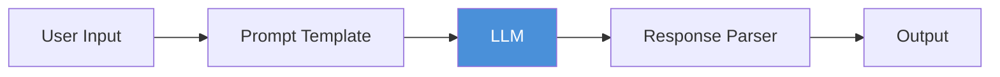
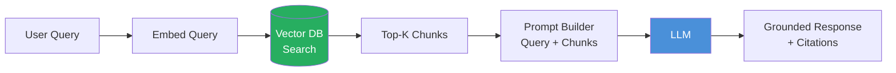
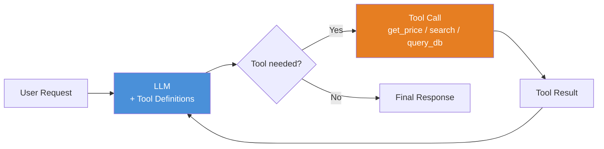
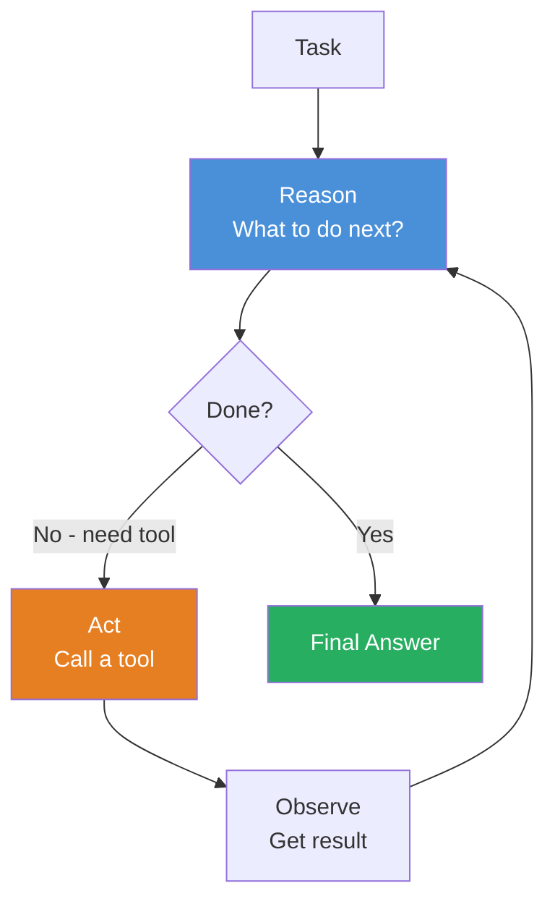
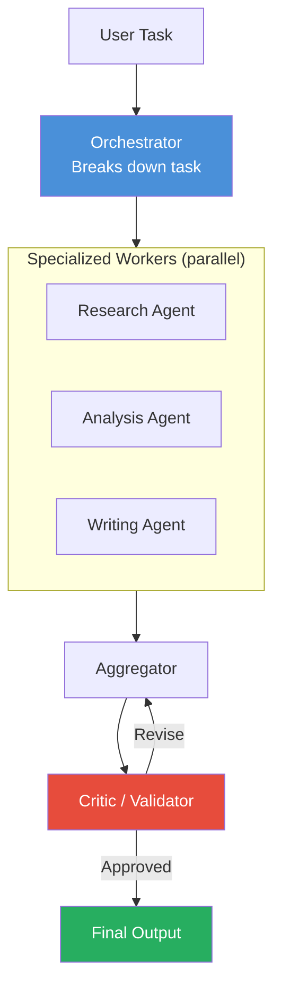

# Module 9 — GenAI System Design Patterns

**Estimated time: 30 minutes**

> This module connects everything. Every GenAI system you'll ever build is a composition of these five patterns.

---

## The Five Patterns

```
COMPLEXITY ↑
─────────────────────────────────────────────────────────────────
Pattern 5: Multi-Agent Workflow
  Multiple specialized agents coordinating toward a goal

Pattern 4: Agent Loop
  LLM + tools + reasoning loop + memory

Pattern 3: Tool-Using LLM
  LLM that can call functions and use real-time data

Pattern 2: Retrieval Augmented Generation (RAG)
  LLM grounded in your own documents and data

Pattern 1: Simple LLM Application
  Prompt in → LLM → response out
─────────────────────────────────────────────────────────────────
COMPLEXITY ↓
```

Choose the **simplest pattern that solves your problem**. Complexity has a real cost in latency, debugging, and reliability.

---

## Pattern 1 — Simple LLM Application

**What it is:** A direct call to the LLM. Your application sends a prompt, receives a response.



**When to use it:**
- Summarization, translation, classification, rewriting
- Tasks that don't require external knowledge
- Tasks where the LLM's training data is sufficient

**Example systems:**
- Email tone improver
- Code comment generator
- Customer review sentiment classifier
- SQL formatter / explainer

**Key characteristics:**
```
Latency:     Low (single LLM call)
Cost:        Low (only input + output tokens)
Reliability: High (simple path, few failure points)
Flexibility: Low (can't access fresh data or take actions)
```

**Code skeleton:**
```python
def run(user_input: str) -> str:
    prompt = TEMPLATE.format(input=user_input)
    return llm.call(prompt, temperature=0.0)
```

---

## Pattern 2 — Retrieval Augmented Generation (RAG)

**What it is:** Before calling the LLM, retrieve relevant documents from your knowledge base. Inject them into the prompt so the model reasons over your real data.



**When to use it:**
- Your app needs domain-specific or private knowledge
- You need answers to be current (LLM training data is stale)
- You need citations and traceability
- You need to control what the model knows (scope its knowledge)

**Example systems:**
- Internal documentation assistant
- Legal contract Q&A
- Product knowledge base chatbot
- Financial report analyzer

**Key characteristics:**
```
Latency:     Medium (embed + search + LLM)
Cost:        Medium (embedding + LLM tokens for context)
Reliability: High (deterministic retrieval)
Flexibility: Medium (limited to what's in the knowledge base)
```

**The core retrieval tradeoffs:**

```
RECALL vs. PRECISION IN RAG
─────────────────────────────────────────────────────────────
Retrieve too few chunks:
  Fast, cheap, but may miss the answer

Retrieve too many chunks:
  Slower, more expensive, but better coverage
  Risk: "lost in the middle" — model ignores middle context

Sweet spot: 3–5 high-quality chunks via reranking
─────────────────────────────────────────────────────────────
```

---

## Pattern 3 — Tool-Using LLM

**What it is:** Extend the LLM with the ability to call external functions. The LLM decides when and which tools to call based on the user's request.



**When to use it:**
- You need the LLM to access real-time data (prices, weather, APIs)
- You need the LLM to perform calculations
- You need structured integration with your existing systems
- Single-turn tasks that require one or two tool calls

**Example systems:**
- Customer support bot that can look up order status
- Financial assistant that queries live portfolio data
- DevOps bot that can query metrics dashboards
- Scheduling assistant that calls calendar APIs

**Key characteristics:**
```
Latency:     Medium-High (depends on tool count and response time)
Cost:        Medium (LLM + tool execution)
Reliability: Medium (tool failures need handling)
Flexibility: High (can access any data or system you expose as a tool)
```

**Design rule:** Give the LLM the *minimum* set of tools needed for the task. More tools = more chances for the LLM to pick the wrong one.

---

## Pattern 4 — Agent Loop

**What it is:** A fully autonomous reasoning loop. The LLM reasons, acts, observes, and repeats until the task is complete. It decides the entire execution path.



**When to use it:**
- Multi-step tasks where the next step depends on the previous result
- Exploratory or research tasks with unknown paths
- Tasks that require dynamic decision-making
- Automation of complex workflows that can't be predefined

**Example systems:**
- AI research agent (searches, reads, synthesizes)
- Bug investigation agent (traces logs, reads code, proposes fixes)
- Competitive analysis agent
- IT incident response agent

**Key characteristics:**
```
Latency:     High (multiple LLM calls per task)
Cost:        High (N × LLM calls + tool executions)
Reliability: Lower (more steps = more failure opportunities)
Flexibility: Very High (adapts to any situation within tool scope)
```

**Non-negotiable constraints:**
```
□ Maximum iteration limit (e.g., 20 steps)
□ Timeout (e.g., 5 minutes max per task)
□ Human approval gate for destructive actions
□ Full trace logging for every step
```

---

## Pattern 5 — Multi-Agent Workflow

**What it is:** Multiple specialized agents collaborate. An orchestrator delegates work to workers, pipelines pass data through specialized stages, or critic agents validate generator output.



**When to use it:**
- Tasks too large for a single context window
- Tasks that benefit from specialization (research vs. writing vs. verification)
- Tasks that can be parallelized across independent sub-problems
- Workflows requiring quality gates between stages

**Example systems:**
- AI software development pipeline (architect → coder → reviewer → tester)
- Content production pipeline (researcher → writer → editor → fact-checker)
- Data analysis pipeline (extractor → analyst → summarizer → formatter)

**Key characteristics:**
```
Latency:     Highest (but parallel workers help)
Cost:        Highest (N agents × M calls each)
Reliability: Complex (need coordination, error propagation)
Flexibility: Maximum (can tackle virtually any complex task)
```

---

## Pattern Comparison Matrix

```
                    P1:Simple  P2:RAG  P3:Tools  P4:Agent  P5:Multi-Agent
─────────────────────────────────────────────────────────────────────────────
Uses your data?       No       Yes      No        Yes       Yes
Real-time data?       No       No       Yes       Yes       Yes
Takes actions?        No       No       Yes       Yes       Yes
Multi-step logic?     No       No       No        Yes       Yes
Parallelizable?       Yes      Yes      Partial   No        Yes
Easiest to debug?     ✓✓✓      ✓✓       ✓✓        ✓         ✗
Production-ready?     ✓✓✓      ✓✓✓      ✓✓        ✓         ✓(complex)
Startup cost?         Low      Medium   Medium    High      Very High
─────────────────────────────────────────────────────────────────────────────
```

---

## Pattern Composition

Real systems often combine patterns. The key is to identify the core pattern and add complexity only where needed.

```
COMPOSITION EXAMPLES
─────────────────────────────────────────────────────────────
Internal chatbot:
  P2 (RAG) + P3 (Tools for ticket creation)
  = RAG retrieves docs, tools create support tickets

Code assistant:
  P3 (Tools: read_file, run_tests) + P1 (code generation)
  = Agent-lite that can read and test but not wander

Research pipeline:
  P5 (Multi-agent) where each worker uses P2 (RAG) + P3 (Tools)
  = Workers specialize in different knowledge bases

Customer support:
  P1 (for FAQs) → escalate to P2 (RAG for product docs)
  → escalate to P3 (Tools for order lookup)
  = Tiered complexity based on query type
─────────────────────────────────────────────────────────────
```

---

## Design Decision Framework

When you receive a new GenAI system requirement, run through these questions:

```
DECISION QUESTIONS
─────────────────────────────────────────────────────────────────────
1. Does the task require specific/private knowledge?
   No  → Pattern 1 (Simple LLM)
   Yes → Add Pattern 2 (RAG)

2. Does the task require real-time data or system integration?
   No  → Stay with P1 or P2
   Yes → Add Pattern 3 (Tools)

3. Does the task require multiple dependent steps?
   No  → P1, P2, or P3 is sufficient
   Yes → Use Pattern 4 (Agent loop)

4. Is the task too large for one context window, or does it benefit
   from specialization?
   No  → P4 is sufficient
   Yes → Pattern 5 (Multi-agent)

ALWAYS: Start simpler. Add complexity only when you hit a real limit.
─────────────────────────────────────────────────────────────────────
```

---

## Key Takeaways — Module 9

- Every GenAI system is a composition of 5 fundamental patterns
- Start with the simplest pattern that could work — complexity has real costs
- Pattern 2 (RAG) is the workhorse of production systems — most apps need it
- Pattern 4 (Agent loop) is powerful but requires strict safety constraints
- Pattern 5 (Multi-agent) is for genuinely complex, large-scale tasks
- Compose patterns — real systems combine multiple patterns
- The question is never "should I use agents?" but "what's the minimum complexity needed?"

---

**Next:** [Module 8 — Production Considerations](./module-08-production-considerations.md) |
[Capstone — System Designs](./capstone-system-designs.md)